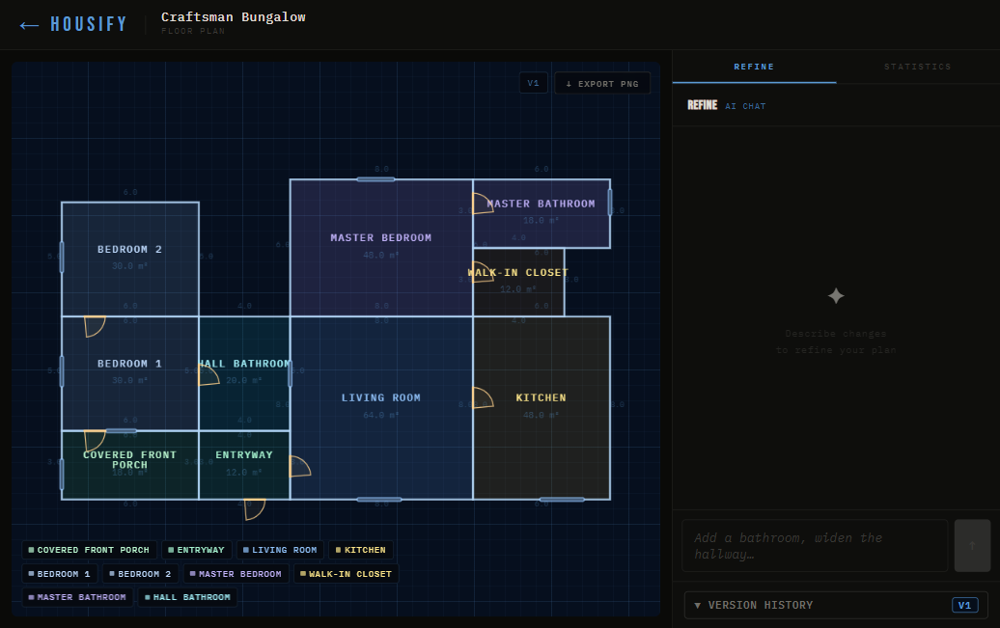
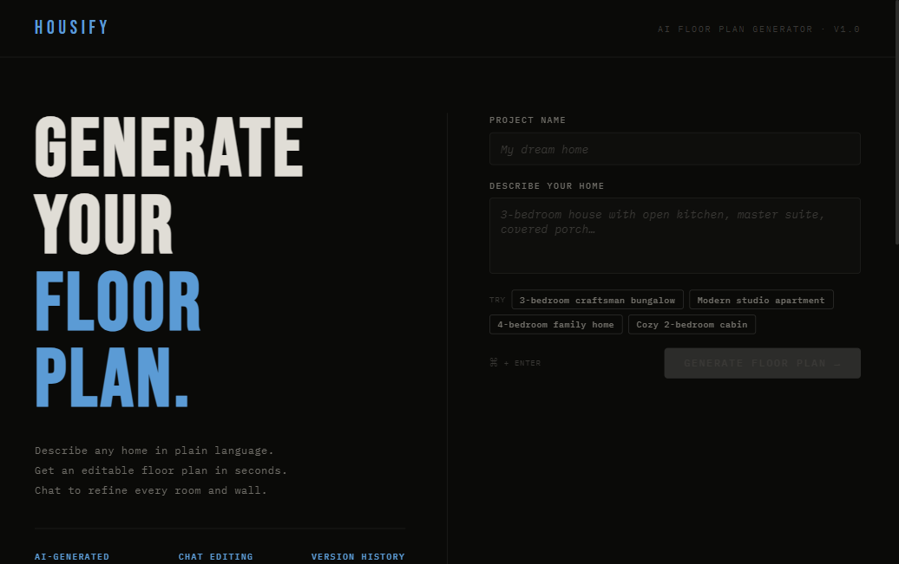
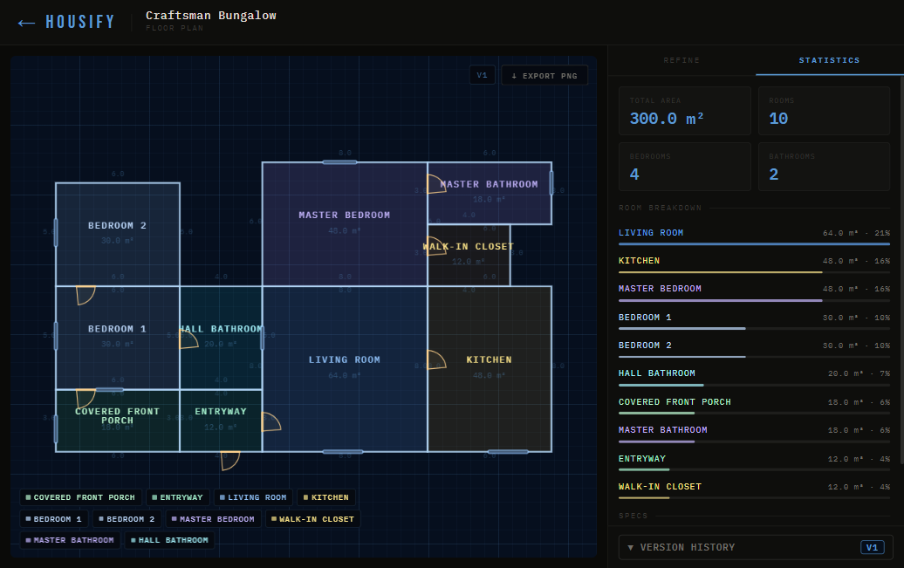

# Housify — AI Floor Plan Generator

> Describe a home in plain English. Get an editable, versioned floor plan in seconds.

<p align="center">
  
</p>

Type a brief. Watch rooms, walls, doors, and dimensions appear as an architectural blueprint. Chat to refine anything — every change is versioned.

---

## What it does

You describe a house. Housify uses an LLM to generate a complete floor plan as a geometric DSL — rooms as polygons, walls, doors, and windows with real positions and dimensions. Chat to refine any aspect of the plan, and every edit is versioned so you can revert at any time.

> *"3-bedroom craftsman bungalow, open kitchen flowing into living room, master suite with walk-in closet, covered front porch"*

<table>
<tr>
<td width="55%">

<br><sub>Describe any home — or pick a prompt to get started instantly.</sub>
</td>
<td width="45%">

<br><sub>Statistics panel: total area, room breakdown, bedroom and bathroom counts.</sub>
</td>
</tr>
</table>

---

## Features

- **Natural language → floor plan** — LLM generates a complete DSL with room polygons, openings (doors/windows), roof config, and wall dimensions
- **Blueprint canvas** — cyanotype blueprint rendering with room type color-coding, door swing arcs, window symbols, and dimension labels
- **Chat-based editing** — "add a second bathroom", "widen the hallway", "move the kitchen" — the AI updates the plan in real time with streaming responses
- **Version history** — every chat edit creates a new version; revert to any previous state
- **Plan statistics** — total floor area, room breakdown with visual bars, bedroom/bathroom count
- **Export PNG** — download the blueprint at 2× resolution
- **Cost-controlled** — $0.10 per generation cap, LLM provider switchable (Claude / Ollama)

---

## Architecture

```
┌─────────────────────┐     ┌──────────────────────────────────────┐
│   React Frontend    │────▶│         Django REST Backend          │
│   Vite + TypeScript │◀────│   Uvicorn · SQLite · Celery/Redis    │
│   Konva 2D canvas   │     │                                      │
│   Zustand store     │     │  /api/projects/          CRUD        │
│   SSE streaming     │     │  /api/.../chat/stream/   SSE         │
└─────────────────────┘     │  /api/.../phase/         Versioning  │
                            └──────────────────────────────────────┘
                                          │
                            ┌─────────────▼────────────┐
                            │      LLM Provider         │
                            │  Claude (Anthropic API)   │
                            │  Ollama Cloud (fallback)  │
                            └──────────────────────────┘
```

**Key technical decisions:**
- Floor plans stored as a typed Pydantic DSL (rooms as CCW polygon arrays, openings with wall segment + offset)
- Pure Python geometry validation (no Shapely) — overlap detection, winding order, wall-segment openings
- SSE streaming for real-time chat — token-level updates with tool call events
- LLM uses structured tool-use (`edit_floorplan`) to return validated DSL updates
- Version chain — each edit stores `parent_version`, full revert graph preserved

---

## Stack

| Layer | Technology |
|-------|-----------|
| Frontend | React 18, TypeScript, Vite, Konva, Zustand, React Router |
| Backend | Django 5, Django REST Framework, Uvicorn (ASGI) |
| AI | Anthropic Claude API (claude-sonnet-4-6) |
| Queue | Celery + Redis (infrastructure ready, async generation pipeline) |
| Database | SQLite (dev) |
| Container | Docker Compose |

---

## Running locally

**Requirements:** Docker Desktop

```bash
git clone https://github.com/<your-username>/housify
cd housify/housify

# Add your API key
echo "ANTHROPIC_API_KEY=your_key_here" >> backend/.env

docker compose up --build --force-recreate
```

Open `http://localhost:5173`.

**Environment variables** (in `backend/.env`):

| Variable | Description |
|----------|-------------|
| `LLM_PROVIDER` | `claude` or `ollama_cloud` |
| `ANTHROPIC_API_KEY` | Anthropic API key |
| `ANTHROPIC_MODEL` | Model ID (default: `claude-sonnet-4-6`) |
| `LLM_MAX_USD_PER_GEN` | Cost cap per generation (default: `0.10`) |

---

## How generation works

1. User submits a brief → `POST /api/projects/`
2. Backend calls LLM with a structured prompt containing the floor plan DSL schema
3. LLM returns a JSON document: rooms (polygon arrays), openings (door/window positions), roof config
4. Geometric validator checks polygon winding, detects overlaps, validates opening positions
5. DSL saved as `PhaseDoc(version=1)`, rendered immediately in the browser

For chat edits:
1. User message + current DSL sent to LLM via SSE stream endpoint
2. LLM streams text tokens (visible in real time) then optionally calls `edit_floorplan` tool
3. Tool call triggers new DSL → validation → `PhaseDoc(version=N+1)`
4. Frontend reloads canvas automatically

---

## Project structure

```
housify/
├── backend/
│   ├── floorplan/       # DSL, generator, chat, validator, tools
│   ├── projects/        # Project model, version history, chat turns
│   ├── llm/             # Provider abstraction (Claude, Ollama)
│   └── ecc/             # Django settings, Celery config
└── frontend/
    ├── src/
    │   ├── pages/        # Home, ProjectShell, PhaseFloorplan
    │   ├── components/   # FloorplanCanvas, ChatPanel, StatsPanel, VersionPanel
    │   ├── lib/          # API client, SSE stream handler
    │   └── store/        # Zustand project state
    └── index.html
```

---

## Roadmap

- [ ] 3D room extrusion (Three.js already integrated)
- [ ] Furniture placement via LLM
- [ ] PDF export with architectural title block
- [ ] Multi-floor plans
- [ ] Real-time collaborative editing

---

